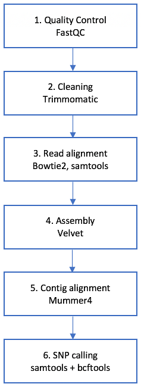

## 3. Containerising a WGS workflow

 [\<\< Part 2](https://github.com/PawseySC/bio-workshop-18/blob/master/2.fastqc.md)
 | [TOC](https://github.com/PawseySC/bio-workshop-18/blob/master/TableOfContents.md) |
 [Part 4 \>\>](https://github.com/PawseySC/bio-workshop-18/blob/master/4.hpc.md)
______

### Before we start
Scripts covering some of the examples in this Episode are in a subdirectory:

    cd bio-workshop-18/episode3_wgs_workflow/

---
### A sample bioinformatics workflow
The `data_files/` folder contains two paired read files from a plant called *Fagopyrum tartaricum*, as well as a reference genome from another plant of the same Genus, namely *Fagopyrum_esculentum*.

From inside `episode3_wgs_workflow/`, You are going to work with the following sample workflow:

This is meant to be a toy workflow, to illustrate how different types of packages can be containerised with Docker, and also to comment on some specific issues that can arise with certain containers.

---
### Hands-on: build your own containerised workflow
You will build the workflow using the skills you acquired in [Episode 1](https://github.com/PawseySC/bio-workshop-18/blob/master/1.containers.md) and [Episode 2](https://github.com/PawseySC/bio-workshop-18/blob/master/2.fastqc.md).

You won't need to build it from scratch! In the Episode folder, there is a file named `workflow_start_here` that already contains the standard, non-containerised version of the workflow. This is your starting point.

Here are your tasks:
1. Identify all the container repositories required for the workflow and pull them using shifter.  
  Ideally, you would search for each package in QUAY Hub or Docker Hub; however, to save time during this workshop, you can find the list of repositories to be downloaded in the file `containers`.
2. For each step in the workflow, write a bash script that executes the corresponding commands using Docker containers
3. Write a driver bash script that executes the step scripts in sequence.

Some useful tips:
- in the Episode directory there are template containers ready for use;
- you can define and execute multiple containers in the same script;
- to have a more readable container execution line, define environment variables with the container repository names;
- you will need to specify some Docker flags, as in [Episode 2](https://github.com/PawseySC/bio-workshop-18/blob/master/2.fastqc.md); an environment variable can again be useful for the purpose;
- for the pull and the driver scripts, you can just write a sequence of commands, or ... use a `for` loop.

Some hints for special cases:
- for Java packages, you will need to inspect the container to find out the location of the .jar file;
- for Trimmomatic, adapters are in the `adapters` directory inside the Episode directory;
- output redirection with `>` works straight away with Docker containers;
- input redirection with `<` and piping with `|` requires some care, with an extra Docker flag required (review those discussed in [Episode 1](https://github.com/PawseySC/bio-workshop-18/blob/master/1.containers.md)).

---
### Trimmomatic: a Java container

______
 [\<\< Part 2](https://github.com/PawseySC/bio-workshop-18/blob/master/2.fastqc.md)
 | [TOC](https://github.com/PawseySC/bio-workshop-18/blob/master/TableOfContents.md) |
 [Part 4 \>\>](https://github.com/PawseySC/bio-workshop-18/blob/master/4.hpc.md)
